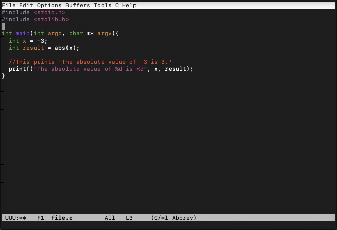

# capibara README

capibara-emacs is the emacs plugin for using Capibara documentation.



## Features

- Quick documentation lookup bound to `F2` based on the the crowd-sourced C library definitions contributed to Capibara.

- Code offline! Definitions are cached locally and only get trigger a download.

## Commands

- You can manually call a lookup via the `(capibara-lookup)` command.

- You can manually trigger a redownload of the documentation via the `(capibara-refresh-definitions)` command.

- You can view plugin sponsorship and about info via the `(capibara-sponsorship)` command.

## Requirements

This extension utilizes the built-in json library and your version of emacs must be compiled for json support.

## Extension Settings

This extension contributes the following settings:

- `~/.emacs-capibara-definitions.json`: This is the filepath that the emacs extension will use to download and read definitions.

## Installation:
1) Put `capibara.el` in your load-path.
The load-path is usually `~/elisp/`.

2) Next include capibara in your `~/.emacs` startup file like this:
```
(add-to-list 'load-path (expand-file-name "~/elisp"))
(require 'capibara)
(capibara-default-bindings)
```

## Release Notes

### 1.0.0

Initial release of capibara-emacs.

---

## For more information

- [Capibara](https://capibara.tools/)

**Enjoy!**